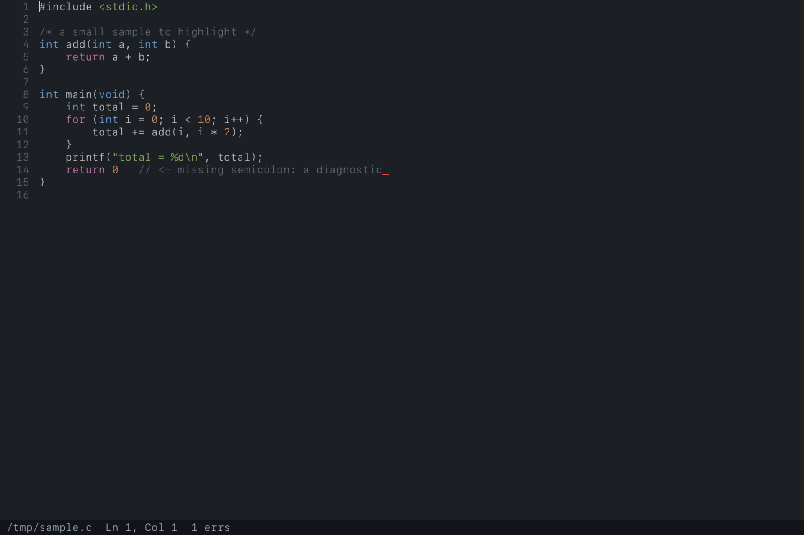

# Wave

A code editor written from the ground up in C: tree-sitter for syntax, a custom
batched OpenGL renderer, and (next) LuaJIT extensions.

**Working today:**

- Opens a single file **or a whole folder** (`./build/wave .`). Opening a folder
  starts on an empty state — no file is opened until you click one in the sidebar
  (or Cmd-P).
- **Sidebar file browser** — the folder's tree with folder/file icons. Folders
  start collapsed; click one (or its disclosure triangle) to expand or collapse
  it. A single click on a file *previews* it in a reused tab — click through as
  many files as you like without piling up tabs — and a double click (or editing
  it) pins it as a permanent tab.
- **Cmd-P fuzzy file finder** — type to filter, ↑/↓ + Enter to open. Results are
  ranked: matches at filename boundaries and in the basename float to the top,
  with the best match preselected. Works from the empty (no file open) state too.
- **Cmd-Shift-F project-wide content search** — type a query and see ranked
  `path:line` matches with the matching text, streamed live; ↑/↓ (or the wheel)
  to move, Enter to jump straight to that line/column, Esc to close. Backed by a
  **bundled ripgrep** (`make` vendors `rg` into `vendor/rg`), so it works out of
  the box with no global install; it falls back to a system `rg` if present.
  Also reachable from the empty state.
- **Tabs** — every opened file gets a tab; click to switch, click its `x` (or
  `:q`) to close, `gt`/`gT` or Cmd-]/Cmd-[ to cycle.
- **Vim-style modal editing** — normal / insert / visual modes with the common
  motions and operators (see Keys).
- **`gd` go to definition / `gh` info** — works with or without a server: when
  one is running `gd`/`gh` use real LSP results, otherwise they fall back to a
  tree-sitter heuristic (nearest in-file definition / node + diagnostic). `gh`
  opens a **popover** anchored to the cursor with the diagnostics under it plus
  the server hover; it caps its height and scrolls (wheel, `j`/`k`, or ↑/↓) when
  the content overflows, flips above the cursor near the bottom edge, and shifts
  to stay on screen. `Esc` (or any move / click) dismisses it.
- **Undo / redo** — `u` / Ctrl-R (or Cmd-Z / Cmd-Shift-Z); a typing burst
  undoes as one step.
- **LSP** — Language Server Protocol client showing real diagnostics, hovers
  (`gh`), and cross-file go-to-definition (`gd`). The TS/JS server is **bundled**
  (`make` vendors it into `vendor/lsp`; Wave runs it via `bun`/`node`), so it
  works out of the box with no global install; C uses the system `clangd` if
  present. No server (no clangd, or no JS runtime) → tree-sitter fallbacks.
- **tree-sitter highlighting for C, JavaScript, JSX, TypeScript, TSX** — picked
  by file extension, driven by external `queries/<language>/highlights.scm`
  files, with live syntax-error underlines.



## Download

Prebuilt macOS builds are on the [Releases](../../releases) page —
**Apple Silicon (arm64), macOS 11+**.

1. Download `Wave-<version>-macos.zip` and unzip it.
2. Move `Wave.app` to `/Applications`.
3. Launch Wave. Release builds are signed and notarized for macOS Gatekeeper.

To build from source instead, see [Build & run](#build--run). Packaging targets:
`make bundle` assembles `Wave.app`; `make dist VERSION=x.y.z` produces the
release zip; `make icon` regenerates the app icon.

## Architecture

Headless core (no GUI dependency — this is what the tests link against):

```
piece_table  ─ append-only text storage; original text is mmap'd read-only,
               inserts append to a grow buffer. Edits never copy the document.
buffer       ─ a document: open/save + a stream of tree-sitter-shaped edit
               records (byte range + row/col points) for incremental reparse.
highlight    ─ owns a TSParser/TSTree; drains buffer edits, applies them with
               ts_tree_edit(), reparses incrementally, runs the language's
               loaded highlights query to emit colored spans, and walks the
               tree for ERROR/MISSING diagnostics. Parses straight from the
               piece table via a TSInput callback — never flattens the document.
               Grammar-agnostic: the language is passed in.
langs        ─ maps a file extension to a grammar and loads
               queries/<language>/highlights.scm from the source tree, build
               tree, or app bundle resources (C, JavaScript/JSX, TypeScript,
               TSX).
workspace    ─ an opened folder: a recursively scanned, display-ordered tree of
               files and subdirectories (skips .git, node_modules, build, …).
search       ─ project-wide content search: spawns the bundled ripgrep as a
               child process and streams its path:line:col:text output back
               asynchronously (non-blocking pipe + a poll pump), parsing it into
               ranked hits. A missing rg just yields no results.
lsp          ─ an async Language Server Protocol client: spawns a server
               (clangd / typescript-language-server) as a child process and
               speaks JSON-RPC over its stdio (own tiny JSON parser + string
               builder). Non-blocking — requests fire and replies are picked up
               by a poll pump — and optional: a missing binary just disables it.
               clangd runs with --background-index so go-to-definition crosses
               files to the actual definition body (not just the header
               declaration) and diagnostics are project-wide.

               The TypeScript / JavaScript server is *bundled*, not assumed to
               be on your machine: `make` vendors typescript-language-server +
               typescript into vendor/lsp, and Wave launches it through bun (or
               node) from a path resolved relative to its own binary — so a
               shipped Wave has working TS/JS LSP with no global install. C uses
               the system clangd (part of LLVM) if present. A missing server (no
               clangd, or no JS runtime) just falls back to the tree-sitter
               heuristics.
```

GUI layer:

```
font         ─ bakes a monospace glyph atlas (ASCII) once via stb_truetype.
render       ─ batched OpenGL 3.3 renderer: every glyph/rect for a frame goes
               into one vertex buffer, drawn in a single glDrawArrays call.
               Solid rects (cursor, gutter, diagnostic underlines) reuse the
               text shader via negative UVs.
main         ─ GLFW window + input; per frame, lays out only the visible line
               range, colors glyphs from highlight spans, draws the gutter,
               cursor, diagnostic underlines, and a status bar.
```

Next planned layers: a parse worker thread (double-buffered tree + lock-free
edit queue), viewport-driven shaping cache, and a LuaJIT scripting thread that
talks to the core through message queues only.

## Build & run

```sh
make            # builds the static core + the `wave` app (+ bundles the TS LSP + ripgrep)
make app        # just the GUI app
make lsp        # just (re)vendor the bundled TS/JS language server
make rg         # just (re)download the bundled ripgrep
make test       # builds + runs the core test suite
./build/wave .                # open the current folder (sidebar + Cmd-P); no file open until you pick one
./build/wave path/to/file.tsx # open a single file (its folder becomes the sidebar)
./build/wave --line 42 --column 8 path/to/file.tsx # open at a 1-based location
./build/wave                  # empty scratch buffer
```

First build clones the tree-sitter runtime and the C / JavaScript / TypeScript
grammars into `vendor/`, vendors the bundled TS/JS language server into
`vendor/lsp/` (via `bun install`, falling back to `npm`), and downloads a
prebuilt **ripgrep** for content search into `vendor/rg/` (`make rg`). It
requires GLFW (`brew install glfw`) and, for the TS/JS server at runtime, `bun`
or `node` on `PATH`. The font path is SF Mono
(`/System/Library/Fonts/SFNSMono.ttf`).

### Keys

Window:

- **Cmd-P** — fuzzy file finder (type to filter, ↑/↓, Enter to open, Esc to close)
- **Cmd-Shift-F** — project-wide content search (ripgrep; ↑/↓ or wheel, Enter to jump, Esc to close)
- **Cmd-B** — toggle the sidebar · single-click a file to preview it, double-click to keep it open
- **Cmd-S** — save · click in the text to place the cursor
- **Cmd-]** / **Cmd-[** — next / previous tab · **Cmd-W** — close tab ·
  click a tab to switch, click its `x` to close
- **Cmd-+** / **Cmd--** — zoom the whole UI in / out · **Cmd-0** — reset zoom
- **Alt-Z** — toggle word wrap (on by default; also `:wrap` / `:nowrap`)

Vim modal editing (starts in **NORMAL**):

- Motions: `h j k l`, `w b e`, `0 ^ $`, `gg`, `G`, counts (e.g. `5j`), arrows
- Enter insert: `i a I A o O`, leave with `Esc`
- Operators: `d` / `c` / `y` + a motion — `dd dw de db d$ d0 d^ dh dl dj dk dG
  dgg` (and counts, e.g. `3dd`, `d2j`); `cc cw C`, `yy`, `x s D`
- Paste: `p` / `P` · Undo / redo: `u` / Ctrl-R
- Visual: `v` then a motion, then `d` / `y` / `c`
- Navigate: `gd` go to definition, `gh` diagnostic / hover / node info popover
  (scroll it with `j`/`k` or ↑/↓; `Esc` closes), `gt` / `gT` next / previous tab
- Command line: `:w` `:q` `:wq` `:q!` `:qa`

### Config

UI preferences persist in `~/.config/wave/config` (a flat `key=value` file),
loaded at startup. It's rewritten automatically whenever you change one of these
(zoom, word wrap, sidebar), or on demand with `:config`:

```
wrap=1         # word wrap on/off
scale=1.000    # UI zoom factor (Cmd +/-)
sidebar=1      # sidebar visible
side_cells=26  # sidebar width in character cells
opacity=1.000  # window opacity 0.2..1.0 (:opacity 0.85)
radius=7.0     # UI corner radius 0..24 px (:radius 10)
blur=0         # macOS background blur behind the window (:blur)
titlebar=1     # macOS native traffic lights floating over our header (:titlebar)
```

Transparency and blur are adjustable live: `:opacity 0.85` makes the window
translucent, and `:blur` toggles a macOS frosted-glass layer behind it (a
transparent framebuffer is always requested, so opacity changes need no
restart). Both persist to the config.

On macOS the window uses a transparent, full-size-content title bar: the native
traffic-light buttons (close / minimise / zoom) float over the top-left of
Wave's own header band — the VS Code / Cursor look — with the title hidden and
that band kept draggable. Toggle it with `:titlebar` (falls back to the standard
OS title bar when off).

### Headless snapshot (for verification)

```sh
WAVE_SNAPSHOT=out.ppm ./build/wave file.c          # render one frame, exit
WAVE_TYPE='int x = 1\n' WAVE_SNAPSHOT=out.ppm ./build/wave   # type, then snapshot
```

## Layout

```
src/      piece_table, buffer, highlight, langs, workspace, lsp, search (core)
queries/  tree-sitter highlight queries loaded at runtime and bundled into app
          + font, render, main (gui)
tests/    test_piece_table, test_buffer, test_highlight, test_workspace,
          test_lsp (drives a real clangd: cross-file go-to-definition +
          live diagnostics; skips cleanly if clangd isn't installed),
          test_search (drives a real ripgrep; skips cleanly if rg is absent)
          + tiny harness
vendor/   tree-sitter runtime + C/JS/TS grammars (fetched by make),
          the bundled TS/JS language server (lsp/) + ripgrep (rg/),
          stb_truetype.h
```
